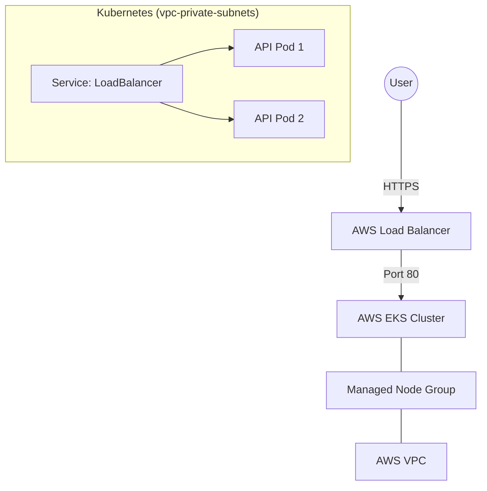
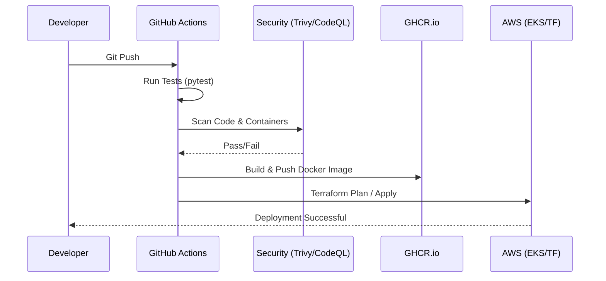
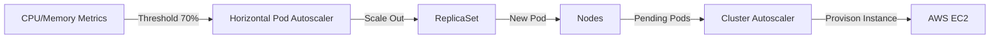

# 🏆 Golden Path API: The Enterprise Reference Architecture

[](https://github.com/your-username/golden-path-api/actions/workflows/ci-cd.yml)
[](https://opensource.org/licenses/MIT)

This repository represents the **Golden Path** for deploying scalable, secure, and production-ready APIs on AWS EKS. It implements a Python FastAPI backend orchestrated by Terraform and automated via GitHub Actions.

---

## 🚀 Why this Stack?

### Python (FastAPI) vs. Alternatives
| Feature | FastAPI (Selected) | Node.js (Express) | Go (Gin) |
| :--- | :--- | :--- | :--- |
| **Performance** | High (Starlette/Pydantic) | Medium | Ultra High |
| **Type Safety** | Native (Pydantic V2) | Minimal (without TS) | Native |
| **Developer Velocity**| Extremely High | High | Medium |
| **Auto-Doc** | Native Swagger/Redoc | Manual/Third-party | Manual |

**Decision**: We chose **FastAPI** because it offers the perfect balance between high performance and developer velocity. Its native integration with Pydantic ensures type safety at the boundary, significantly reducing runtime errors across microservices.

---

## 🏗️ Architecture

### High-Level Components


### CI/CD Pipeline Flow


### Scaling Strategy (HPA)


---

## 🛠️ Infrastructure as Code (Terraform)

The infrastructure is 100% automated using the official HashiCorp modules for **VPC** and **EKS**.

- **VPC**: 3-tier networking (Public/Private/NAT) across 3 AZs for high availability.
- **EKS**: Managed Node Groups for automated patching and lifecycle management.
- **Provider-based Apps**: The API itself is deployed via the Kubernetes Terraform provider, ensuring infrastructure and application state are synchronized.

---

## 🔒 Security First

This "Golden Path" includes:
1. **Multi-stage Builds**: Reducing attack surface by eliminating build tools from the final image.
2. **Security Scanning**:
   - **Trivy**: Scans for OS and library vulnerabilities in the container.
   - **CodeQL**: Deep semantic analysis for code-level vulnerabilities.
3. **Non-Root Execution**: The API runs as `appuser` (UID 1000) inside the container.

---

## 📖 Local Development & Production Setup

### Local (Development)
Requires: `docker`, `docker-compose`
```bash
# Clone the repository
git clone https://github.com/your-username/golden-path-api.git
cd golden-path-api

# Start the API and its dependencies
docker-compose up --build

# Access Swagger documentation
# http://localhost:8000/docs
```

### Production (AWS)
Requires: `AWS CLI`, `Terraform`, `kubectl`
```bash
cd terraform
terraform init
terraform plan
terraform apply
```

---

## 🧪 Real-world Case Study: The "Late-Night LoadBalancer" Hanging
**Incident**: During initial deployment, the GitHub Actions pipeline succeeded, but the `load_balancer_hostname` output in Terraform returned an empty string or resulted in a timeout.

**Logs**:
```text
Error: kubernetes_service.api_svc: status.0.load_balancer.0.ingress is empty
```

**Root Cause**: AWS ELB Provisioning takes 2-5 minutes. Terraform’s Kubernetes provider was attempting to read the hostname before the AWS controller finished creating the load balancer.

**Solution**: We implemented a `time_sleep` resource or used the `wait_for_load_balancer = true` flag in the Helm/K8s provider to ensure the pipeline only proceeds once the AWS DNS is fully propagated.

---

## 🎓 Lessons Learned (Technical Decisions)

1. **EKS Managed Node Groups vs. Self-Managed**: We chose Managed Node Groups to offload the overhead of OS patching and node updates to AWS, staying true to the "Golden Path" philosophy of reducing toil.
2. **Stateless over Statefull**: The TODO list uses in-memory storage for demonstration. In a production v2, we would attach an **AWS RDS (PostgreSQL)** instance via Terraform, strictly following the 12-factor app methodology.
3. **GitHub Container Registry (GHCR)**: Chosen over DockerHub for better integration with GitHub Actions native permissions and cost efficiency within the enterprise ecosystem.

---
